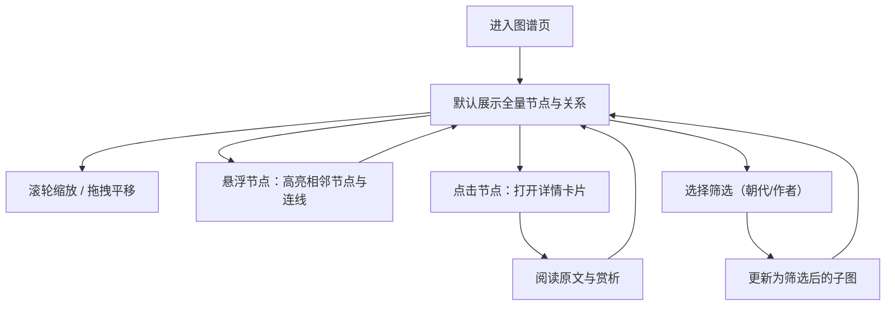

## 1. 产品概述
“唐诗宋词知识图谱学习网络”是一个面向古典文学学习者的可视化探索应用，以力导向关系网络呈现约 1000 首唐诗宋词的关联结构，帮助用户通过作者、朝代与主题的关系快速建立知识框架。
- 目标用户：古典文学爱好者、学生、教师、内容创作者
- 核心价值：从“单篇阅读”升级为“关系式学习”，降低检索成本，提高记忆与理解效率

## 2. 核心功能

### 2.1 功能模块
1. **图谱主视图**：力导向图展示诗词节点与关系连线（朝代/作者/主题）
2. **交互探索**：缩放、拖拽、悬浮高亮联动、点击查看详情
3. **过滤与聚焦（可选加分）**：按朝代/作者筛选，快速聚焦子图
4. **信息详情卡片**：展示标题、朝代、作者、原文、赏析讲解

### 2.2 页面详情
| 页面名称 | 模块名称 | 功能描述 |
|---|---|---|
| 图谱页（单页应用） | 顶部标题栏 | 标题、简短说明、状态提示（当前筛选、节点数量） |
| 图谱页（单页应用） | 筛选区 | 朝代下拉、作者下拉、重置按钮、（可扩展主题下拉） |
| 图谱页（单页应用） | 图谱画布 | 力导向图：节点散点、关系连线、缩放/拖拽/悬浮高亮 |
| 图谱页（单页应用） | 详情卡片 | 点击节点弹出：标题、元信息、原文、赏析；支持关闭 |

## 3. 核心流程
用户在图谱中通过视觉关联探索诗词关系，并在详情卡片中完成“精读”。

## 4. 用户界面设计

### 4.1 设计风格
- 主题气质：古典、纸墨、克制而雅致，避免“科技感霓虹”
- 主色：宣纸暖白、墨黑、朱砂红（强调）、青黛（辅助）
- 字体：标题使用书法/行楷风格字体；正文使用宋体/衬线中文字体，提升“文献感”
- 布局：桌面优先，左侧为图谱主画布，右侧为可收起的详情卡片；顶部为轻量筛选条
- 动效：悬浮高亮与卡片展开使用细腻的过渡（opacity/transform），避免夸张弹跳

### 4.2 页面设计概览
| 页面名称 | 模块名称 | UI 元素 |
|---|---|---|
| 图谱页 | 顶部区 | 纸张纹理背景、题签式标题、少量装饰线与角标 |
| 图谱页 | 筛选区 | 仿古印章色按钮、轻边框下拉、悬停微光/阴影 |
| 图谱页 | 图谱画布 | 深色墨点节点、关系线按类型着色；非关联元素淡化 |
| 图谱页 | 详情卡片 | 纸张卡片、内阴影、分隔线、诗文等宽/行距优化 |

### 4.3 响应式
- 桌面优先：主画布占据主要空间，详情卡片固定侧边
- 小屏适配：详情卡片切换为底部抽屉式；筛选区换行；触控拖拽优化

