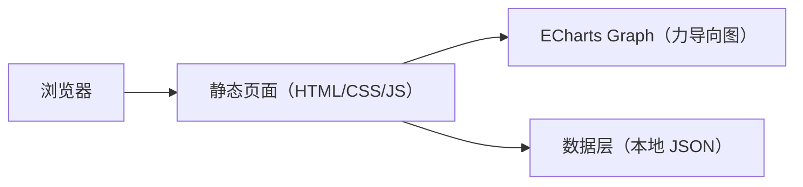

## 1. 架构设计

## 2. 技术说明
- 前端：原生 HTML + CSS + JavaScript（ES Modules）
- 可视化：ECharts 5（Graph 系列，Force 布局，Canvas 渲染）
- 数据：本地 JSON（可后续替换为真实 1000 首数据文件或从后端加载）
- 后端：无（静态站点即可部署到 GitHub Pages）

## 3. 路由定义
| 路由 | 用途 |
|---|---|
| / | 单页应用入口：图谱视图 + 详情卡片 + 筛选 |

## 4. 数据模型

### 4.1 JSON 数据结构
- nodes：诗词节点数组
  - id：唯一标识（string）
  - name：用于节点标签（可在缩放放大后显示标题）
  - dynasty：朝代（唐/宋）
  - author：作者
  - theme：主题类型（送别/边塞/婉约等）
  - content：原文（多行）
  - analysis：赏析讲解
  - symbolSize：节点大小（可按热度/主题权重映射）
- edges：关系连线数组
  - source / target：节点 id
  - relation：关联类型（same_dynasty / same_author / same_theme）
  - lineStyle：颜色与透明度（按关联类型区分）

### 4.2 渲染策略（性能）
- 默认缩小视图：节点不显示标签，仅显示点；放大或选中时显示标题
- 高亮联动：使用 ECharts emphasis + focus adjacency；非相关元素 blur
- 渐进渲染：对大图开启 progressive；控制力导向参数防止抖动

